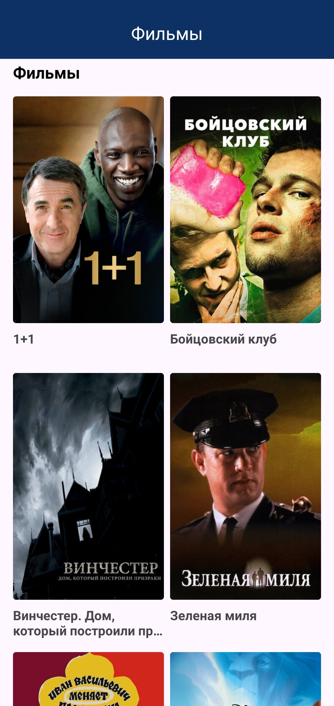
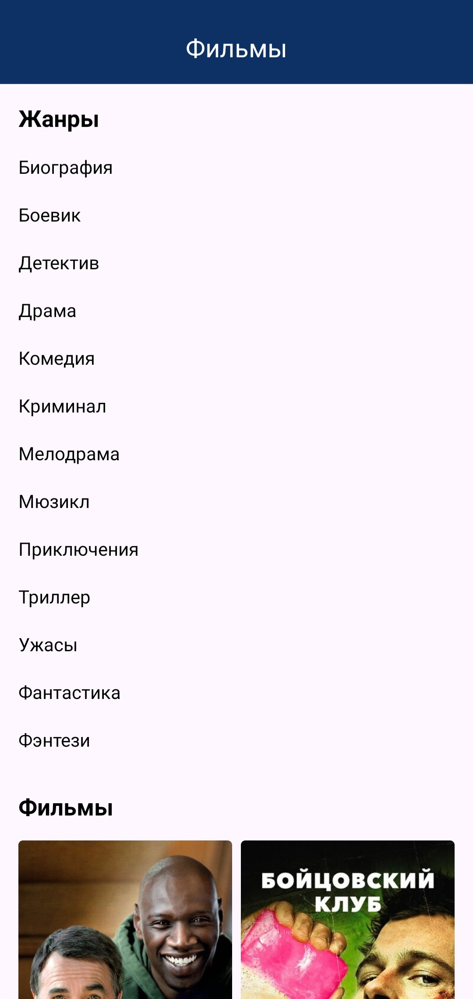
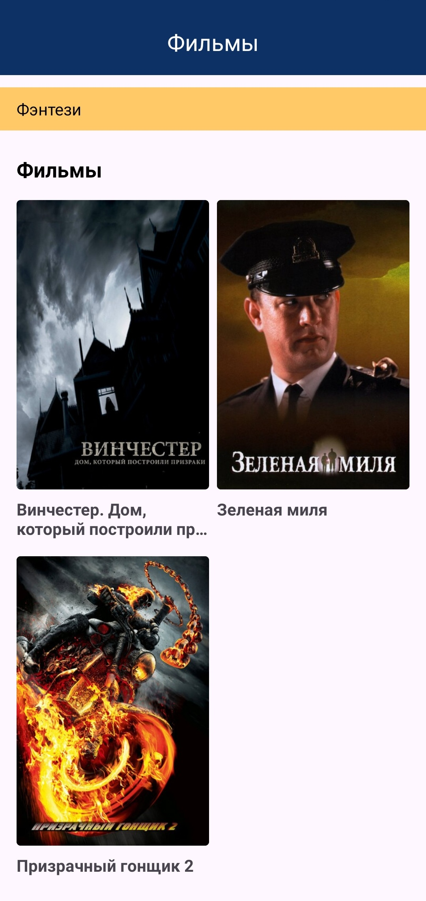
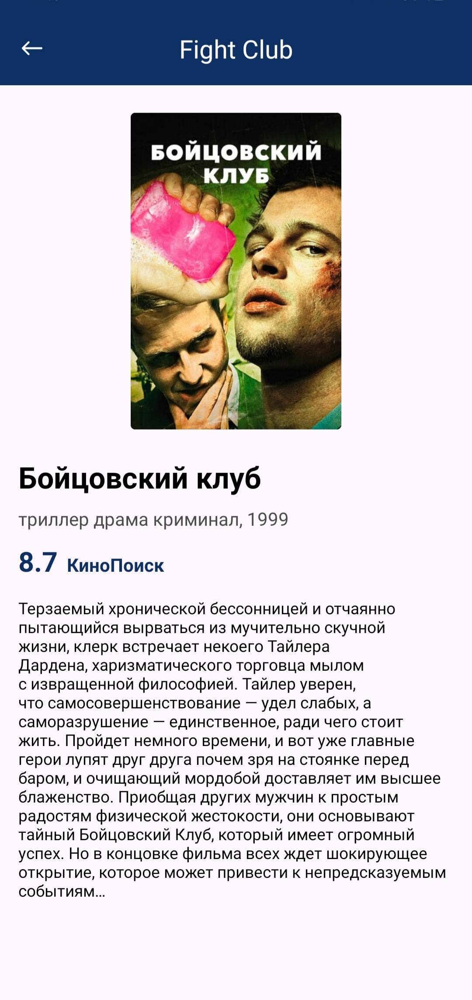
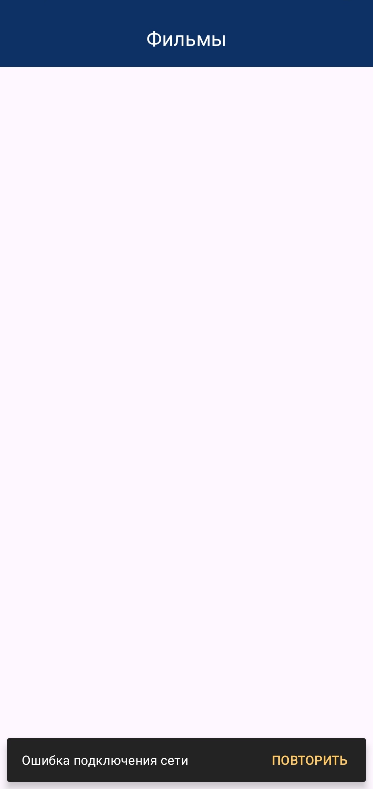
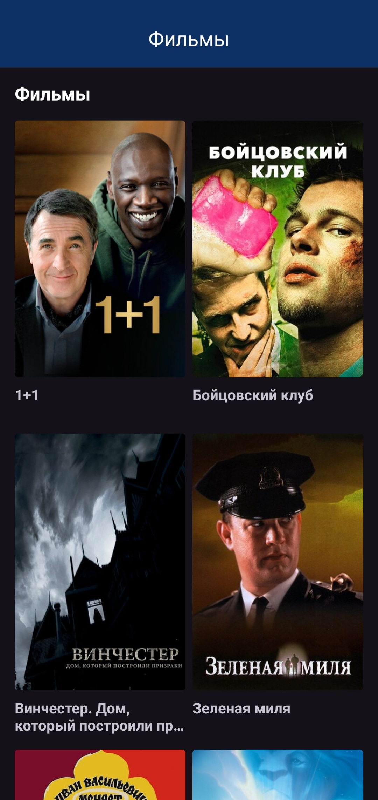
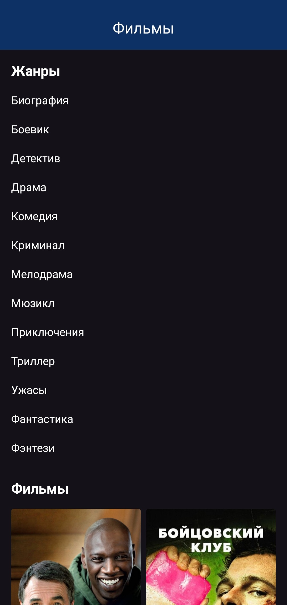
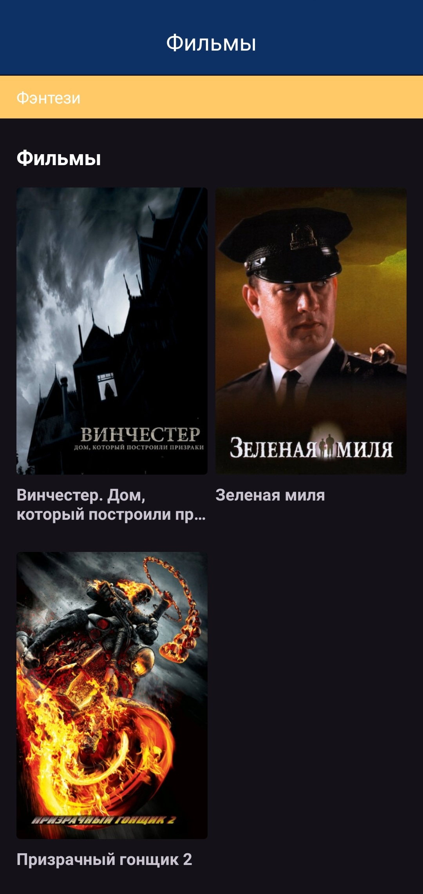
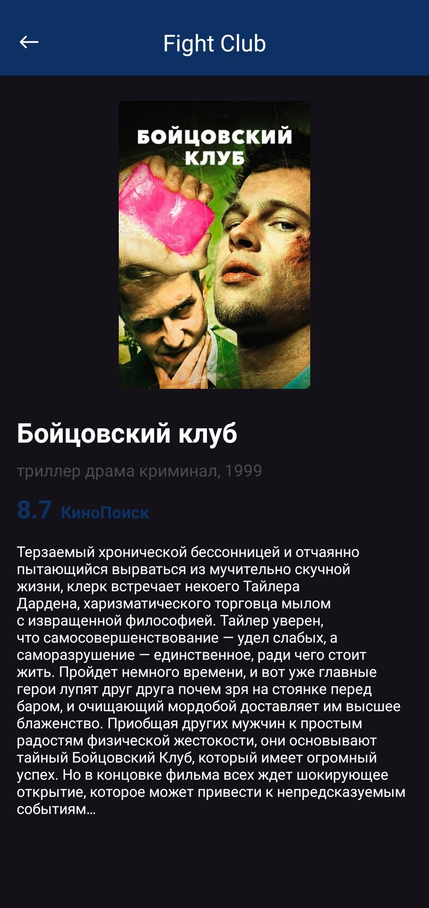
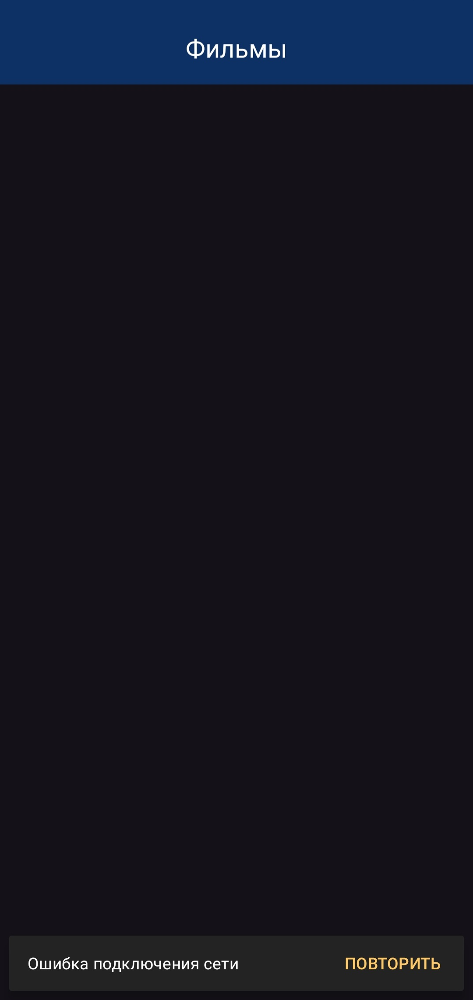

# Скриншоты мобильного приложения [**Films**](https://github.com/LebedevSergeyVach/Sequenia)

---

## Светлая тема

  
  
  
  
  

## Темная тема

  
  
  
  
  

---

#### [README](../README.md) [UP/ВВЕРХ](#up)
